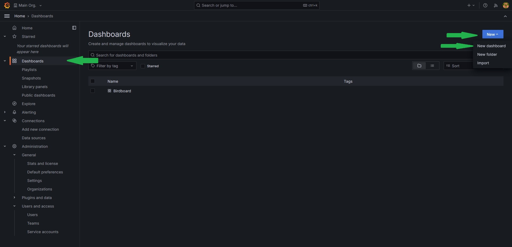

# Dashboard Tutorials

## Basics

In this lesson you will

* Create a Grafana dashboard
* Add visualizations based on the collected data
* Filter the Data to represent secific informations

We have already set up a basic Grafana Instance on the same server the database storing the data lies on. This includes adding the database holding all the collected data as a data souce so that you can directly start creating a dashboard.


## Lesson steps 

### Creating a dashboard
1. Connect to the Grafana server using the following link [http://141.24.194.106:20203](http://141.24.194.106:20203).
2. Log in using the credentials we gave you.
3. Click `Dashboards` on the left.
4. Click `New` on the right and then `New dashboard`.


### Adding visualization
1. Click `Add visualization`.
2. Select `influxdb` as the data source.
3. First we want to see just the raw data, so set the visualization type in the upper right corner to `Table` and set the time frame to `Last 2 years`.
4. Now enter the following query into the text field at the bottom.

   ```flux
   from(bucket: "BirdData")
    |> range(start: v.timeRangeStart, stop:v.timeRangeStop)
    |> group(columns: [])
    |> limit(n:5)
   ```
   
6. When your done click save, give your dashboard a name and click save again


### Adding filters
As you can see, the data contains the confidence value. Since the AI model doesn't have an output for `no bird detected` it will always classify some bird for every measurement. If there is indeed no bird in the sample it will usually show by a very low confidence. So it would be good to filter out entries with a confidence below a certain threshold.

1. Go to the Dasboard settings(the gear at top right) and select the tab `Variables`.
2. Click `Add variable`.
3. Create a variable with the type `Custom`, give it a name(how you refere to the value in your querry, for example `minConf`), a label(Name that will be displayed in the dashboard) and enter some boundaries in custom options(for example `0.9, 0.75, 0.5, 0.25, 0`).
4. Click `Apply` and `Close` at the top right.
5. Click `Add` at the top right and select `Visualization`.
6. Select as visualization type again a `table` and copy the code from earlier.
7. Add a filter command between the range and the group command. The full querry should look something like this.

   ```flux
   from(bucket: "BirdData")
     |> range(start: v.timeRangeStart, stop:v.timeRangeStop)
     |> filter(fn: (r) => r._value > ${minConf},)
     |> group(columns: [])
     |> limit(n:5)
   ```
   
9. Click `Apply` in the top right and compare how the two tables look, especialy for `minConf=0` and `minConf=0.9`.
10. You can edit a visualization by hovering over it with the cursor and clicking at the three dots appearing in the upper rigth corner and then clicking `edit`. Do that for both tables and change their names()On the right side under `Panel options` the field `titel` so that they are distinguishable. Dont forget to save the dashboard once your done.

### Adding a proper visualization
While the raw data might be useful, what we want from a dashboard is seeing important values with ease. So lets add a counter how many birds were recognised with the given confidence 

1. Add another visualization, this time of the type `Stat`
2. You can reuse the query from the filtered table.
3. Instead of limiting the number entries we want to count them. Replace the `limit` command with the count command. It sould look like this:

   ```flux
   from(bucket: "BirdData")
     |> range(start: v.timeRangeStart, stop:v.timeRangeStop)
     |> filter(fn: (r) => r._value > ${minConf},)
     |> group(columns: [])
     |> count()
   ``` 
4. Name the visualization, apply and save.

Another interesting stat would be what birds were recognized the most. Lets add a visualization for that. 

1. Add another visualization. The are some types you can choose from, but this tutorial will use the `Bar gauge` (Hint: Select `Table` as the type to understand how the changes in the query effects the data every step)
2. For the query, we can use the first three lines from the code above since that essentially just returns all measurements that have the required confidence.
3. Next, we want to group all measurements that were of the same bird. We can do this by `|> group(columns: ["birdId"])`. This creates groups of measurements with the same `BirdID`. You can imagine a group as a simple table.
4. Since we want to know how often each bird was detected we add `count()`. This counts the measurements in every group and replaces the group content with that value.
5. For the `Bar gauge` we need the data in a single group, but right now every bird has its own group. We fix this by adding `group()`.
6. Finally we want the birds in order, therefore we need to sort the current group. We can do this by adding `sort(desc: true)`. This sorts our group entries in descending order, meaning the bird that was spotted the most often should be listed first.

   ```flux
   from(bucket: "BirdData")
     |> range(start: v.timeRangeStart, stop:v.timeRangeStop)
     |> filter(fn: (r) => r._value > ${minConf},)
     |> group(columns: ["birdId"])
     |> count()
     |> group()
     |> sort(desc: true)
   ```
   
8. On the right side under `Value options` change `Calculate` to `All values`
9. You can customise the visualization if you want. For example changing the orientation to horizontal makes it easier to understand. Dont forget to save once your done.
10. As you might have noticed, instead of bird names the bars are labled with the IDs. This is due to way the data is stored in the database. For now its fine, but if you're insterested you can check [here](https://github.com/Science-Camp-TUI/birdnet-mini/blob/main/idToLabels.csv) which ID belongs to which bird.

### Accesing an external ressource/Adding labels
In the last task we had the problem that the measurements in the DB only holds the IDs of the classified bird, but not the actual name. But fortunatly we have a table holding the IDs and corresponding names. In this step we want to load the data into the query and modify the result form the last task in a way that the bars are labled with the actual name rather than the ID.

1. First, reopen the visualization by hovering the cursor over the diagramm, clicking the three dots in the upper right corner and selecting `edit`
2. Bind the current query result to a variable. You can do this by choosing a name(we will use `left` since we will perform a left join later but any name is valid) and writing `name=` in front of the `from(bucket: "BirdData")`.
3. Next add the following three lines at the top of the query. These packages provide the functions to load and transform the table from earlier into a flux query object

   ```flux
   import "csv"
   import "experimental/http"
   import "join"
   ```
   
5. Now we first need to load the csv using the following line. This simply performs a `HTTP get` request to github to the same ressource that is linked to earlier. (You might notice that the links aren't identical. This is due to github usually providing a visualy enhanced file. But since we need the raw data we access that in this querry directly. If you're curious you can open the link from the sample to see the raw data yourself)

   ```flux
   csvData = string(v: http.get(url: "https://raw.githubusercontent.com/Science-Camp-TUI/birdnet-mini/main/idToLabels.csv").body)
   ```
   
7. For now the csvData variable only holds the data as a string(basically a long line of characters). To transform this to a proper flux query object we need to parse it. Fortunatly there is a laready defined function for that in the `csv`-packge we imported earlier. Add the following line to your code. Note that we bind the result to the variable `right` as the second part of our join operation.
   ```flux
   right=csv.from(csv: csvData, mode: "raw")
   ```
8. Now that the label data is loaded and parsed we can combine it with our earlier result. To do that we need to perform a `left join` on the earlier result. Just copy the code below into your query. You can read [this](join.md) if you don't know what a `join` is.

   ```flux
    res=join.left(
       left: left,
       right: right,
       on: (l, r) => l.birdId == r.BirdID,
       as: (l, r) => ({l with name: r.GermanName, _value: l._value}),
   )
   ```
   
10. The only things left to do is clarifying what data to show and to sort that data. We can do this by removing all colums that are unnessisary and keeping only the `name` and the `_value` colums of our `join` result `res` and sorting after that. Your query code should look like this.
   
   ```
   import "csv"
   import "experimental/http"
   import "join"
   
   
   csvData = string(v: http.get(url: "https://raw.githubusercontent.com/Science-Camp-TUI/birdnet-mini/main/idToLabels.csv").body)
   right=csv.from(csv: csvData, mode: "raw")
   
   
   left=from(bucket: "BirdData")
     |> range(start: v.timeRangeStart, stop:v.timeRangeStop)
     |> filter(fn: (r) => r._value > ${minConf},)
     |> group(columns: ["birdId"])
     |> count()
     |> group()
     |> sort(desc: true)
   
   
   
   res=join.left(
       left: left,
       right: right,
       on: (l, r) => l.birdId == r.BirdID,
       as: (l, r) => ({l with name: r.GermanName, _value: l._value}),
   )
   
   res
   |> keep(columns: ["name", "_value"])
   |> sort(desc: true)
   ```

11. You can customize the visualization. Dont forget to save once you're done. 

### Free working
Now that you have some basic knowlege about writing queues you can add visualisations for other stats you think are important freely. Some possible examples are

 - What is the relation between the detected bird species(Pie chart)
 - Add a filter for a specific bird type
   - How often was the selected bird detected(Stat)
   - At what times over the day was the bird detected(Time series)
   - Where was the bird detected(Geomap)
- Add a filter for the different meassurement locations
   - All already mentioned things but filterd for the station
- And a lot more...

If you need help you can always ask the instructor. A helpful ressource is the [flux documentation](https://docs.influxdata.com/flux/v0/) for general questions.
