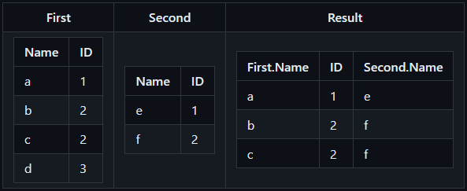
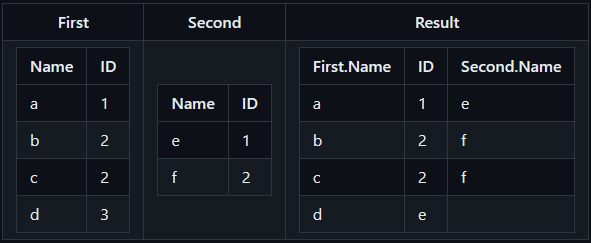

# What is a `join`? 
A `join` is a data operation where usually two tables get combined into one. There are essentially three types of `join`, `full join/ outer join`, `left/right outer join` and `inner join`.
   A `full join` is when every entry from the first table is connected with every entry from the second table resulting in all possible combinations.
   
   
      
   An `inner join` is when every is when every entry from the first table gets combined with every entry of the second table that matches some condition, usually that the value of a specific field of the first entry is the same as the value of a specific field of the second entry. Entries from the first table for which no matching entry from the second table can be found get deleted.
   
   
   
   A `left/right join` is the same as an `inner join`, but entries from the first(`left join`) or the second(`right join`) table dont get deleted even if no match is found for them.
   
   
