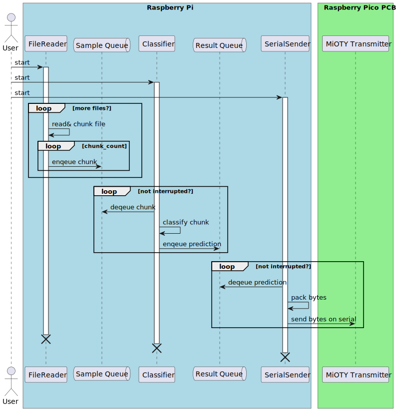
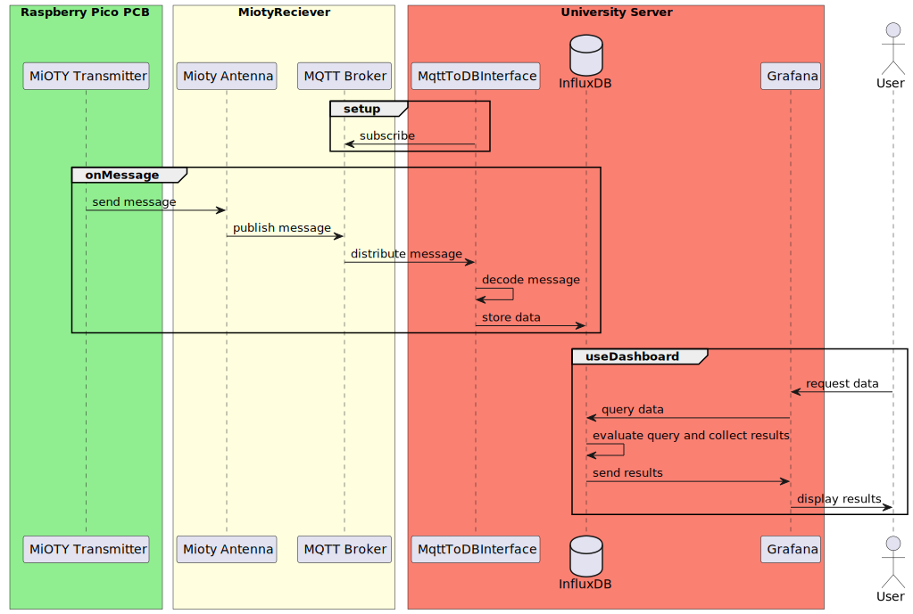

# IoT System Tutorials

Now that you know how to process audio and classify them, you will learn how to 

* continuously process incoming audio data

* classify the data and accumulate the results

* transmit the classification data via a long range transmission network. 

In the scenario, we are simulating, the process of classifying bird songs is continuous. Imagine using a microphone with enough energy resources, the system could be put into the woods for days for recording and continuously transmitting its results.

In this tutorial we simulate the microphone with a file reader.

The following sequence diagram shows the systems data flow and the components that are involved. 



The following components have already been set up by us and are only shown here for the sake of completeness, of the components shown you will only work with Grafana during the dashboard tutorial.



## Lessons Steps

As you can see from the diagram, the main components run in parallel and transmit their data via so called queues. In order to make them run in parallel we use Python Threads [^1]. 

We will use a class for each component. The class will contain all the necessary methods and attributes to run the component. The common structure will be as follows. 

```python
from threading import Thread

class ComponentClass(Thread):

    def __init__(...):
        raise NotImplementedError

    def interrupt(self):
        raise NotImplementedError

    def run(self):
        raise NotImplementedError
```

The main things to considers during this lessons are:

* which information / data / object does each component need (we shall add them in the `__init__` method)

* what do we need to do in the run method (which, for the most components will loop endlessly)

* how can we interrupt the main loops of each component.  **This is important because it gives the user the possibility to stop the program before finishing.**

Before starting, download the files 

* [SMM11597_20240330_151602.wav](./files/SMM11597_20240330_151602.wav){:target="_blank"} 

* [SMM11597_Summary.txt](./files/SMM11597_Summary.txt){:target="_blank"} 

and copy them into a new folder `real_data` in your project folder. We will use the folder in all steps of this tutorial.

### Part 1: The File Reader

1. Create a file `file_reader.py` in the `birdnet_mini` folder. In this file, implement the `FileReader` class using the template from above.

2. The `FileReader` class constructor shall receive 

    * a file path to one ore more audio files, 
    * a path to a meta data file created by the microphone containing the time stamps of the audio files and the latitude/longitude coordinates of the microphone during recording, 
    * the queue to send the sample chunks and metadata to 
    * and the sample rate it shall create the chunks with (we will fix the duration (3s), overlap (0s) and min length (1) in this tutorial). 
    
    Store these values in member variables (e.g. `self._sample_rate`).

3. Still in the `__init__`  method, parse the folder for all audio files (wav, or mp3 etc.) and store the file paths in a list as a member variable.

4. Download the file [metadata.py](./files/metadata.py){:target="_blank"}  in the `birdnet_mini` folder and use the `MetaData` class from this file to store it in the member variable `self._metadata`. **(Optional)** Instead of downloading the implementation of the `MetaData` class, you can also implement it yourself. For format reference check the file  [SMM11597_Summary.txt](./files/SMM11597_Summary.txt){:target="_blank"}  from the `real_data`.

5. Implement the `run` method. In this method, you iterate over the audio file names one by one in a loop and extract the metadata per file and create the chunks of audio data. 

    a. Before opening the audio file, extract the basename of the file  (e.g. `SMM11597_20240330_151602`)[^2] and use it to get the `timestamp`, `latitude (lat)` and `longitude` using the `MetaData.get_timestamp_lat_lon` method.

    b. Use the methods `open_audio_file` and `split_signal` from your `audio.py` file to get the chunks from the audio file. 

6. For each chunk put a tuple to the sample queue that contains `(chunk, timestamp, latitude, longitude)` in a second nested loop. In each iteration of the outer loop, check if the component has been interrupted. If so, break the loop.

### Part 2: The Classifier

1. Create a file `classifier.py` in the `birdnet_mini` folder. In this file, implement the `BirdClassifier` class using the template from above.


2. The `BirdClassifier` class constructor shall receive 

    * an instance of the Model class you implemented in the previous lesson, 
    * the queue to receive the sample chunks and metadata from
    * and the queue to send the classification results to (result queue).

    Store these values in member variables (e.g. `self._model`).

3. Implement the `run` method. In this method, create an loop that runs until `self._interrupted` is `True`. In this loop

    * retrieve the next tuple of  `(chunk, timestamp, latitude, longitude)`. Use the `Queue.get` method with a short timeout of `0.1` to retrieve the tuple [^3].
    * classify the chunk using the `Model.predict` method.
    * Store the result in a dictionary:
        ```python
        data = {
            "class_id": class_id,
            "confidence": confidence,
            "lat": random_lat,
            "lon": random_lon,
            "timestamp": datetime.datetime.now().timestamp()
        }
        ```   
4. Put the data into the result queue.


### Part 3: The Transmitter (Serial Sender)

1. Create a file `transmission.py` in the `birdnet_mini` folder. In this file, implement the `SerialSender` class using the template from above.

2. The `SerialSender` class constructor shall receive 

    * the queue to read the classification results from (result queue)
    * the serial port to be used  (e.g. `/dev/ttyUSB0` or `COM1`) to send the data to
    * the serial baud rate to be used. Set it to `115200` as default.
    * an interval in seconds to when data shall be sent. This is important, since the the receiving Raspberry Pico can only handle a certain amount of data per second. Set it to `2` as default.

3. Implement the `run` method. In this method, create a loop that runs until `self._interrupted` is `True`. In this loop

    * retrieve the next classification result. Use the `Queue.get` method with a short timeout of `0.1` to retrieve the tuple [^3].
    * Since we cannot send the whole dictionary (e.g. as Json) we need to pack the data as efficiently as possible. Store the values of the dictionary in a list with the following order:
        ````python
        data_simple = [data_dict['class_id'], data_dict['confidence'],
                           data_dict['lat'], data_dict['lon'], data_dict['timestamp'].timestamp()]
        ```` 
    * Now use the [Python Struct Package](https://docs.python.org/3/library/struct.html){:target="_blank"} to pack the data into a binary data. Use the format string `'Hfffd'` for the packing. 

    * Send the packed data over the serial port. We use the [Python Serial Package](https://pyserial.readthedocs.io/en/latest/shortintro.html){:target="_blank"} to send the data.

    * wait for the time interval before sending the next data.

    * when the loop is interrupted, close the serial port.

### Party 3b: Transmitting directly to the MQTT broker

Due to some limitations of the Mioty system, it is helpful for you to send the data directly to the MQTT broker instead of sending it via the serial port and the antenna. For this reason, we will also create an MQTT sender class. 

1. Create a file `transmissionMQTT.py` in the `birdnet_mini` folder. In this file, implement the `MQTTSender` class using the template from above.

2. The `MQTTSender` class constructor shall receive 

    * the queue to read the classification results from (result queue)
    * an interval in seconds to when data shall be sent. We keep this parameter in order to change the overall system as little as possible, and unlike the port and baud rate, this parameter also has an effect on the behaviour of the broker.

3. In the `__init__` create a MQTT client. We use the [paho-mqtt packet](https://pypi.org/project/paho-mqtt/), the required informations about the broker are in the moodle course.
    * Since we use plain text credentials, it is recommended to bind them to variables in a separately created config.py, and to import only the config in this file.
    * Use the client as a `self` variable. You will have to set username and password for the client as well as address and port of the broker
4. Implement the `run` method. In this method, create a loop that runs until `self._interrupted` is `True`. In this loop

    * retrieve the next classification result. Use the `Queue.get` method with a short timeout of `0.1` to retrieve the tuple [^3].
    * Since we cannot send the whole dictionary (e.g. as Json) we need to pack the data as efficiently as possible. Store the values of the dictionary in a list with the following order:
        ````python
        data_simple = [data_dict['class_id'], data_dict['confidence'],
                           data_dict['lat'], data_dict['lon'], data_dict['timestamp'].timestamp()]
        ```` 
    * Now use the [Python Struct Package](https://docs.python.org/3/library/struct.html){:target="_blank"} to pack the data into a binary data. Use the format string `'Hfffd'` for the packing. 

    * Send the packed data over to the MQTT broker. Use `topicGroup<your group number>` as the topic. You can use the client function publish to do that.

    * wait for the time interval before sending the next data.

    * when the loop is interrupted, close the serial port.


### Part 4: Bringing it all together

Now you have all the components ready. You can now modify your main file `main.py` in the `birdnet_mini` folder. 

1. Import the classes `FileReader`, `BirdClassifier` and `SerialSender` from the respective files.

2. Create instances of the classes and start them as threads.

3. Create an endless loop waiting a short amount of time in each loop, that is surrounded by a code part catching user interrupts (e.g. pressing `Ctrl+C`):

    ```python
    try:
        while True:
            time.sleep(0.2)
    except KeyboardInterrupt:
        ...
    ```
4. when interrupted, stop the threads by calling the `interrupt` method of each component and join the threads using the `Thread.join` method.


### Part 5: The Transmitter PCB (optional)

We use a Rapsberry Pico microcontroller connected via USB serial port. The Hardware is a custom layout created by the TU Ilmenau. I holds the Pico as well as the sending module. 

{width="40%"}

The code for the microcontroller is written in C++ and pretty simple. However, adding it to this tutorial would be too much. The whole repository can be found [here](https://github.com/Science-Camp-TUI/TS-UNB-Lib-Pico) on the `science-camp` branch.


### Part 6: Testing

Connect the Raspberry Pico to your computer and start the python program. You should see the data being sent to the Pico. You can also monitor the mqtt broker, using [this python program](https://github.com/Science-Camp-TUI/mqtt-mini/blob/main/mqtt_client.py). If you are transmitting without the antenna you can use the same credentials for the mqtt broker, otherwise talk to an instuctor.


### Part 7: Transfer to the Raspberry Pi

Once tested successfully, the code needs to be transferred to the Raspberry Pi. You may zip it and copy it over. The instructor will guide you through the process of running the code on the Raspberry Pi.


### Part 8: Database interface (optional)

If you are very fast and want to work on a separate task from this tutorial, you can try to implement the interface between mqtt and the InfluxDB yourself. But be sure to speak to a instructor first.

What the program needs to accomplish is decoding the recieved data, labeling the seperate fields and send it to the database.

[^1]: [Python Threads](https://docs.python.org/3/library/threading.html){:target="_blank"} are used to run multiple tasks concurrently. Threads are lighter than processes and share the same memory space. They are perfect for IO-bound tasks, such as reading from a file or sending data over a network. Please notice that python threads are not real system threads such as in programming languages like C++.

[^2]: You may use the [Python pathlib module stem function](https://docs.python.org/3/library/pathlib.html){:target="_blank"} to extract the basename of the file. 

[^3]: Make sure you handle the `queue.Empty` exception that is raised when the queue is empty and the timeout is over.
